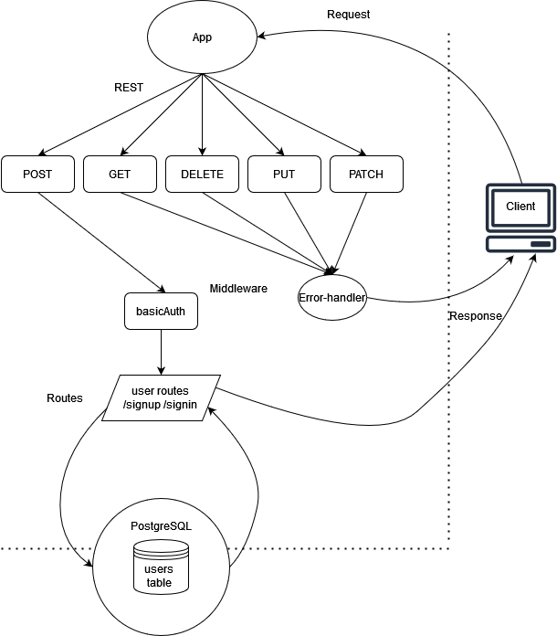

# basic-auth

## Installation

  clone repo, and then in a terminal run the 'npm i' command while in the root directory to install dependencies. 
  
  To run the application, enter the 'npm run start' command in a terminal while in the root directory.

## Summary of Problem Domain

  Create a basic auth application. Application requirements are as follows:
  
  Phase 1 requirements:

    Users will be able to create an account that will persist for future app visits

    Registered users will be able to login to their account so that they may access protected information

    App will have Proper CI/CD configuration

## Links to application deployment

  App deployed on Heroku [here](https://basic-auth-class06.herokuapp.com/)

  Pull req from dev found [here](https://github.com/Beers15/basic-auth/pull/1)

## Uml Diagram

## Routes

* REST Method GET
  * Path: /signin
    * Takes a basic authentication header with a properly encoded username and password combination as input
    * returns the user data as an object as output after account creation, or a proper error response if not request wasn't successful

* REST Method POST
  * Path: /signup
    * takes a JSON obj or form data as input with user and password information
    * returns the user data as an object as output after successful login attempt, or a proper error response if not request wasn't successful
